# 流山JC イベント管理アプリ ユーザーマニュアル

スマホでの利用を前提に書かれています。PC でも同じ操作で使えます。

---

## 目次

- [1. はじめに](#1-はじめに)
- [2. ログイン](#2-ログイン)
- [3. 基本画面の見方](#3-基本画面の見方)
- [4. 一般ユーザー向け操作](#4-一般ユーザー向け操作)
  - [4-1. 自分のイベント一覧](#4-1-自分のイベント一覧)
  - [4-2. イベントに出欠を回答する](#4-2-イベントに出欠を回答する)
  - [4-3. QR コードを受付で見せる](#4-3-qr-コードを受付で見せる)
  - [4-4. イベントを新規作成する (編集者・システム管理者)](#4-4-イベントを新規作成する-編集者システム管理者)
  - [4-5. イベントを編集する (編集者・システム管理者)](#4-5-イベントを編集する-編集者システム管理者)
  - [4-6. プロフィールを編集する](#4-6-プロフィールを編集する)
  - [4-7. パスワードを変更する](#4-7-パスワードを変更する)
- [5. 受付担当者向け操作](#5-受付担当者向け操作)
  - [5-1. 受付モードに切替える](#5-1-受付モードに切替える)
  - [5-2. QR コードをスキャンする](#5-2-qr-コードをスキャンする)
  - [5-3. 懇親会会費を徴収する](#5-3-懇親会会費を徴収する)
  - [5-4. 手動で出欠/受付済を変更する](#5-4-手動で出欠受付済を変更する)
- [6. 管理者向け操作 (編集者・システム管理者)](#6-管理者向け操作)
  - [6-1. 管理者モードに切替える](#6-1-管理者モードに切替える)
  - [6-2. 出席内訳と CSV 書き出し](#6-2-出席内訳と-csv-書き出し)
  - [6-3. ユーザー管理 (ユーザー登録 / 編集)](#6-3-ユーザー管理)
  - [6-4. 設定 (委員会・役職マスター / 表示順 / 参加者リスト)](#6-4-設定)
- [7. よくある質問](#7-よくある質問)
- [8. 困った時は](#8-困った時は)

---

## 1. はじめに

このアプリは流山青年会議所のイベント出欠管理を行うためのものです。スマホで以下のことができます:

- イベント情報の確認(日時・場所・懇親会の有無など)
- 自分の出欠回答
- QR コードでの受付チェックイン
- (管理者向け)イベント作成・編集・出席集計

ロールは 3 種類:

| ロール | できること |
|---|---|
| **閲覧者** | 自分のイベント確認 + 出欠回答。受付担当に指定されていれば受付業務も可 |
| **編集者** | 上記 + イベント作成・編集、ユーザー管理 |
| **システム管理者** | 上記 + 全てのイベントを閲覧可能、システム設定 |

---

## 2. ログイン

### 初回ログイン (仮パスワード)

新規ユーザーには管理者から仮パスワードがメールで届きます。

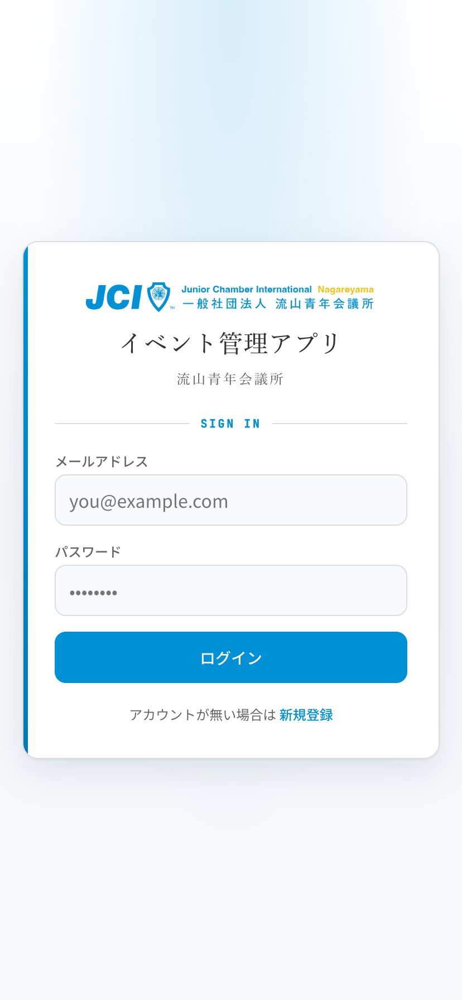

1. アプリの URL を開く
2. メールアドレスと仮パスワードを入力 → 「ログイン」
3. 初回のみ **パスワード変更画面** に飛びます
4. 新しいパスワード(8 文字以上)を 2 回入力 → 「パスワードを変更」
5. 完了するとイベント一覧画面に遷移

> 仮パスワードを変更するまで他の画面には行けません。

### 2 回目以降

メールアドレス + 自分で決めたパスワードでログインしてください。

### パスワードを忘れた場合

現状はパスワードリセット機能は実装されていません。**管理者に連絡** して仮パスワードを再発行してもらってください。

---

## 3. 基本画面の見方

### ヘッダー(上部)
- 左側: 流山JC のロゴ + 「イベント管理アプリ」 → タップでイベント一覧に戻る
- 右側: 自分の名前バッジ + 歯車 (⚙) ボタン
- **管理者モード中** は背景が青色になり、名前バッジに「管理者モード」と表示されます

### 歯車 (⚙) メニュー
タップすると以下を開けます:

- **管理者モードに切替/ユーザーモードに切替** (編集者・システム管理者のみ)
- **プロフィール編集**
- **パスワード変更**
- **ログアウト**

### イベントカードのバッジ
イベント一覧で各カードに表示される小さなバッジ:

| バッジ | 意味 |
|---|---|
| 🛡️ 受付 | あなたが受付担当に指定されているイベント |
| 🍻 懇親会 | 懇親会あり |
| 自作 | あなたが作成したイベント (管理者向け) |
| 回答締切 | 回答期限を過ぎているイベント |
| 下書き | 公開前のイベント (管理者モード時のみ表示) |
| 出席 / 欠席 / 未回答 | あなたの回答ステータス |

---

## 4. 一般ユーザー向け操作

### 4-1. 自分のイベント一覧

ログイン直後の画面が `/events` (= イベント一覧)。

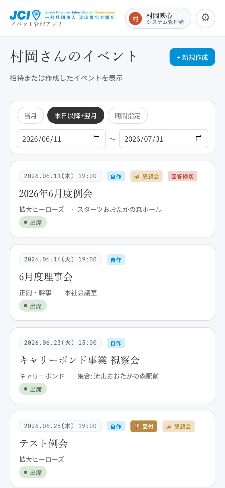

- タイトルは 「**{あなたの苗字}さんのイベント**」
- 表示される範囲は **招待されているイベント + 自分で作成したイベント**
- 期間フィルタ: 「当月」「本日以降+翌月」「期間指定」のチップで切替

### 4-2. イベントに出欠を回答する

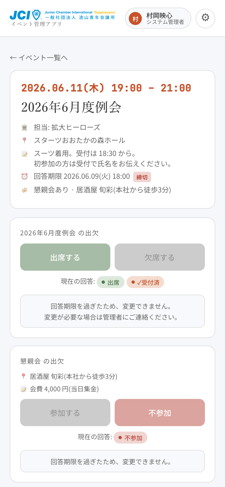

1. 一覧から該当イベントをタップ
2. イベント詳細画面で「**出席する**」または「**欠席する**」の大きなボタンを押す
3. 懇親会ありのイベントなら、さらに「懇親会」セクションで「参加する/不参加」を選択
4. 一番下の「**保存する**」ボタンで確定
5. 保存後、自動でイベント一覧に戻ります

回答を選んで保存待ち状態 (「保存」 ボタンが active になる):


回答は何度でも変更できます(回答期限まで)。

#### 回答期限を過ぎた場合
ボタンがグレーアウトして変更できなくなります。変更が必要な場合は管理者に連絡してください。

### 4-3. QR コードを受付で見せる

出席回答した状態で、当日受付で:

1. イベント詳細画面を開く
2. 一番下の「**📱 受付用 QR コードを表示**」ボタンをタップ
3. QR コードが画面に表示される
4. 受付担当者にスマホ画面を見せてスキャンしてもらう
5. 受付完了後はボタンが「✓ 受付済 (QR を再表示)」に変わります

> 出席回答していない場合 (未回答 or 欠席) は QR ボタンが出ません。先に出欠を「出席」にしてください。

### 4-4. イベントを新規作成する (編集者・システム管理者)

> ⚠️ 編集者・システム管理者の権限を持つ人だけ、**ユーザーモードのイベント一覧画面の右上に「+ 新規作成」ボタン** が表示されます。一般の閲覧者には出ません。
> ⚠️ 「+ 新規作成」 は **ユーザーモード時のみ表示**。管理者モードに切替えると消えます。

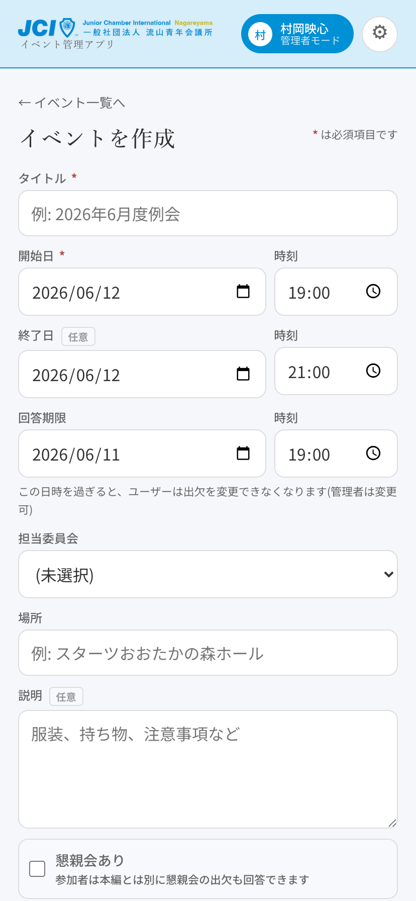

1. ユーザーモードで /events を開く
2. 右上「**+ 新規作成**」ボタンをタップ
3. 入力フォーム:
   - **タイトル** (必須)
   - **開始日 / 時刻** (必須)、**終了日 / 時刻** (任意)
   - **回答期限**: この日時を過ぎるとユーザーは出欠変更できなくなる
   - **担当委員会** (任意): プルダウンから選択
   - **場所** (任意)
   - **説明** (任意)
   - **☑ 懇親会あり**: チェックすると懇親会タイトル/場所/会費説明の入力欄が展開
   - **☑ オブザーバー(ゲスト)を追加**: チェックでゲスト追加 UI が展開
   - **参加者を選択** (必須): 委員会フィルタ + 名前検索でメンバーをチェック
   - **受付担当を選択**: 当日 QR スキャンができる人を指定(作成者は自動で含まれる)
4. ボタンの選択:
   - **公開して作成**: すぐに全員から見える状態で保存
   - **下書きとして保存**: 作成者と編集者だけ見える状態 (公開前の準備)

#### 参加者選択のコツ

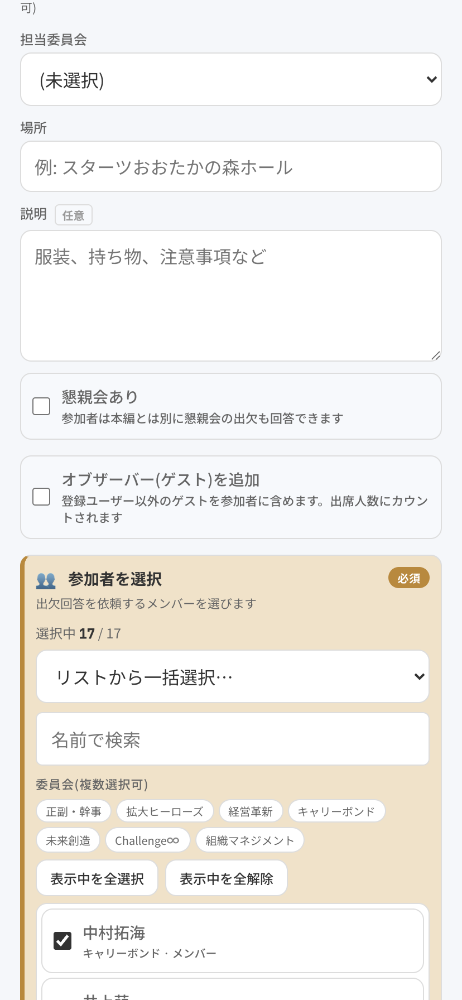

- 「**☑ 全員選択**」「**全解除**」 で一括操作
- 委員会チップで絞り込んでから「全員選択」 で「○○委員会全員を招待」 が簡単
- 検索ボックスで名前の一部入力でも絞り込み可

#### オブザーバー (ゲスト) 追加
- 登録ユーザー以外の参加者を名前だけで追加できる
- 追加された時点で **自動的に「出席」「(懇親会あれば) 参加」** として登録される
- ゲストは本システムを使わないので、状態管理は受付担当者が手動で行う

### 4-5. イベントを編集する (編集者・システム管理者)

> ⚠️ 自分が作成した、または編集権限のあるイベントに対して可能。一般の閲覧者には編集メニューは出ません。

1. イベント詳細画面の右上「**⚙**」 → 「**イベントを編集**」
2. 新規作成と同じフォームで内容を変更
3. 公開状態で開いたものは:
   - 「**保存**」: 公開のまま更新
   - 「**下書きに戻す**」: 下書きに戻す (誤公開のリカバリ用)
4. 下書きで開いたものは:
   - 「**公開して保存**」
   - 「**下書きのまま保存**」
5. 一番下に「**このイベントを削除**」ボタンあり (確認ダイアログ付き)

> 編集はユーザーモード・管理者モードのどちらでも歯車からアクセスできます。
> 会場での内容修正は ユーザーモードで開いている時でも問題なく可能。

### 4-6. プロフィールを編集する

右上の歯車 (⚙) から開くマイメニュー:

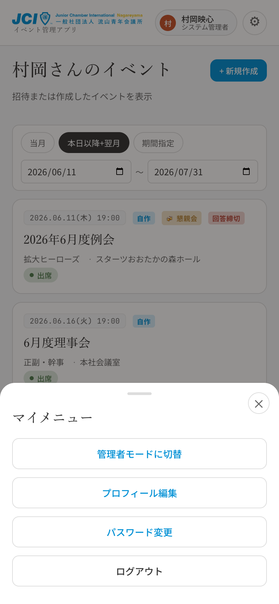

1. 右上の歯車 (⚙) → 「**プロフィール編集**」
2. 姓・名を編集して「保存」
3. 委員会・役職の変更は管理者にご依頼ください(編集者側からは変更できません)

### 4-7. パスワードを変更する

1. 右上の歯車 (⚙) → 「**パスワード変更**」
2. 現在のパスワード + 新しいパスワード (8 文字以上) を入力
3. 「パスワードを変更」

---

## 5. 受付担当者向け操作

イベント作成時に「受付担当」に指定されているユーザーが受付業務を行えます。

### 5-1. 受付モードに切替える

1. 該当イベントの詳細画面を開く
2. 画面上部に「**通常 / 受付**」のトグル切替が表示されます (受付担当者のみ表示)
3. 「**受付**」をタップ
4. 画面が管理者風表示に切替わります(出席数カウント、参加者リスト、QR スキャンボタン等が出る)

通常表示に戻る時は「**通常**」をタップ。

### 5-2. QR コードをスキャンする

1. 受付モードで「**📷 QR コードをスキャン**」ボタンをタップ
2. カメラへのアクセスを許可
3. 参加者のスマホに表示された QR コードをカメラに向ける
4. 自動で読み取り → 「**✓ {名前} さん 受付完了**」のトーストが表示
5. スマホが振動して通知

#### 同じ人を 2 回スキャンした場合
「✕ {名前} さんは既に受付済」と表示され、二重登録は防止されます。

#### カメラが使えない場合
「カメラが使えません」 と表示されます。ブラウザのカメラ権限を確認してください(iOS Safari なら 設定 → Safari → カメラ)。

### 5-3. 懇親会会費を徴収する

懇親会ありのイベントで QR スキャン成功時、自動的に「**会費徴収モーダル**」が表示されます。

選択肢:
- **会費を受領しました** → 受領済として登録、トーストに「受付 + 会費受領」と表示
- **後払い (今は受領しない)** → 受付済だけが付き、会費は別途回収できる状態

> 懇親会に「不参加」と回答済みの人は会費モーダルが出ません(QR スキャンするだけで完了)。

### 5-4. 手動で出欠/受付済を変更する

参加者リスト各行に表示されているボタンで、QR スキャン無しで手動操作できます。

#### ステータスバッジ(名前の右)
- **✓受付済 / 受付未**: タップで受付済 ↔ 未受付を切替
- **💰受領済 / 💰未収**: タップで会費受領状態を切替 (懇親会ありの場合)

#### 出欠ボタン(行の右端)
- **出**: その人を「出席」に変更
- **欠**: その人を「欠席」に変更
- 懇親会あり時はさらに「**懇 出 / 欠**」 (二段目)

> どのボタンも、押すと「**村岡 の出欠を変更します  未回答 → 出席  よろしいですか?**」のような確認ダイアログが出ます。OK で確定。

### 5-5. 複数端末で同時に受付する

複数の受付担当者が同時に作業しても問題ありません:

- **5 秒間隔で自動同期**: 端末 A で受付した結果が、端末 B の画面にも 5 秒以内に反映されます
- **二重チェックイン防止**: 同じ人を 2 台で同時にスキャンしても、片方は「既に受付済」と表示されてデータは壊れません
- **集計も自動更新**: 受付済人数 / 出席内訳が自動で最新に

タブを別のアプリやホームに切替えている間は通信を止めて(バッテリー節約)、戻ってきた時に再開します。

---

## 6. 管理者向け操作

編集者・システム管理者は「**管理者モード**」に切替えることで、出席状況の集計やユーザー管理ができます。

> イベントの **新規作成** ([4-4](#4-4-イベントを新規作成する-編集者システム管理者)) と **編集** ([4-5](#4-5-イベントを編集する-編集者システム管理者)) はモード切替不要で行えます。管理者モードはあくまで **既存イベントの状況確認・運営管理** (出席集計、ユーザー管理、設定) のためのモードです。

### 6-1. 管理者モードに切替える

1. 右上の歯車 (⚙) をタップ
2. 「**管理者モードに切替**」をタップ
3. ヘッダーが青色に変わり、名前バッジが「管理者モード」表示になる
4. /events 画面のタイトルが 「**登録されているイベント**」 に変わる

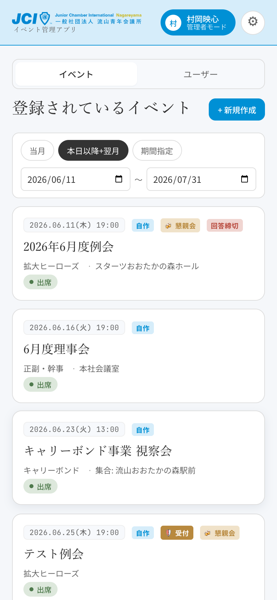

戻る時は同じく歯車 → 「ユーザーモードに切替」。

> ログアウトすると次回ログイン時は自動的にユーザーモードに戻ります。

#### システム管理者と編集者の違い
- システム管理者: 全イベント閲覧可、ユーザー管理可、受付業務可
- 編集者: 招待されたイベントのみ表示、ユーザー管理可、**受付業務は不可**

### 6-2. 出席内訳と CSV 書き出し

管理者モード or 受付モードでイベント詳細を開くと、参加者リストの上に「**出席内訳**」カードが表示されます。

管理者モードでイベント詳細を開いた状態(上部):

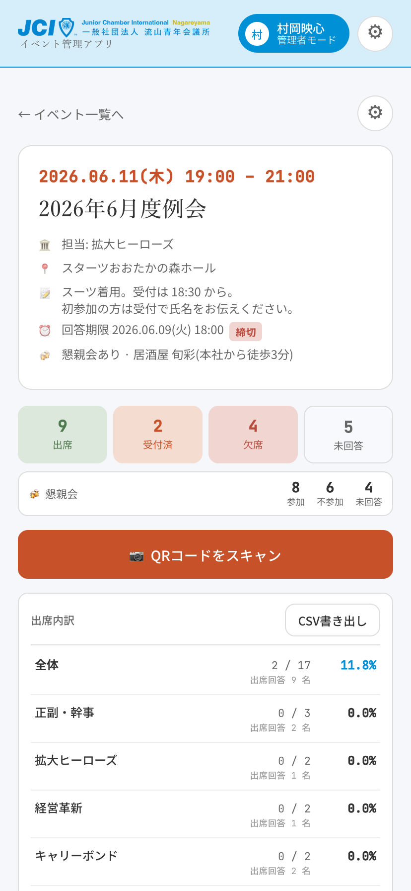

スクロールすると出席内訳と懇親会会費が並びます:

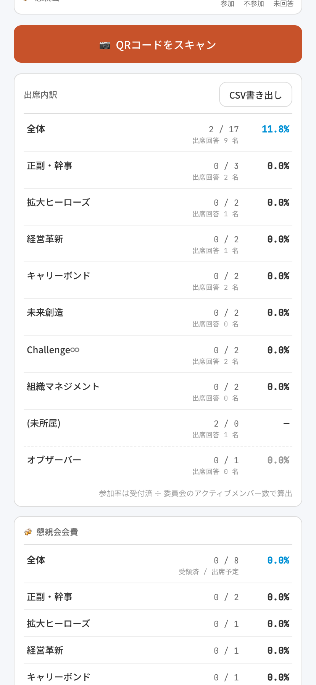

参加者リストはさらに下:

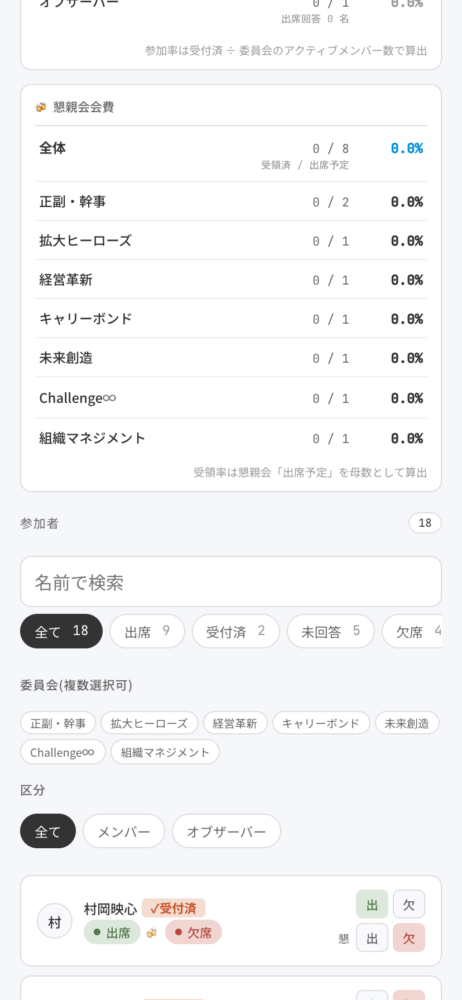

#### 出席内訳カード
- **全体**: 受付済 / 全体メンバー数 + 参加率
- **委員会別**: 各委員会のアクティブメンバー数を分母とした受付率
- **オブザーバー**: ゲストの受付数

#### 🍻 懇親会会費カード (懇親会あり時のみ)
- **全体**: 受領済 / 出席予定人数
- **委員会別**: 同上 (出席予定者がいる委員会のみ表示)

#### CSV 書き出し
「**CSV書き出し**」ボタンで全データを 1 つの CSV ファイルにエクスポートできます。

ヘッダ例:
```
区分, 委員会, 出席数, 出席回答数, 委員会人数, 参加率, 懇親会出席予定, 懇親会会費受領
全体, , 25, 30, 35, 71.4%, 18, 15
委員会別, 拡大ヒーローズ, 5, 6, 7, 71.4%, 4, 3
...
```

### 6-3. ユーザー管理

(編集者・システム管理者)

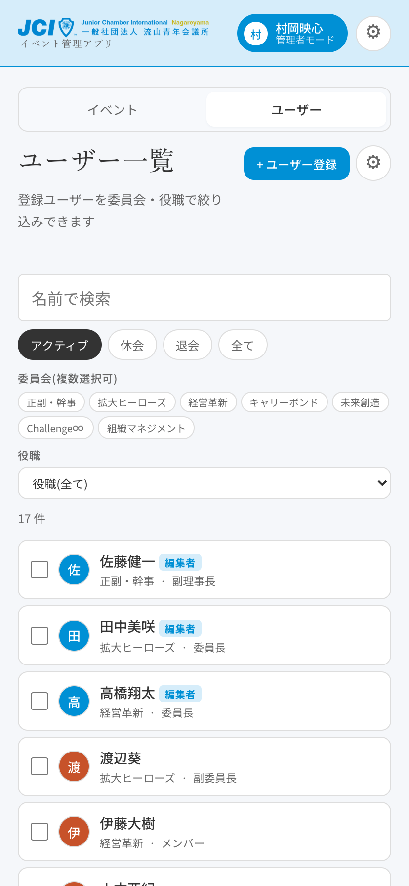

1. 管理者モードで、上部の「**ユーザー**」 タブをタップ (= `/admin/users`)
2. ユーザー一覧が表示される

#### フィルタ
- 名前で検索
- ステータスチップ: アクティブ / 休会 / 退会 / 全て (デフォルトはアクティブ)
- 委員会(複数選択可)
- 役職(プルダウン)

#### 新規登録
右上の「**+ ユーザー登録**」 → モーダル:
- メールアドレス、姓、名、ロール、委員会、役職 を入力
- 「**作成してメール送信**」 で仮パスワードがメールで送られる

#### 個別編集
ユーザー行をタップ → モーダルで編集 → 保存

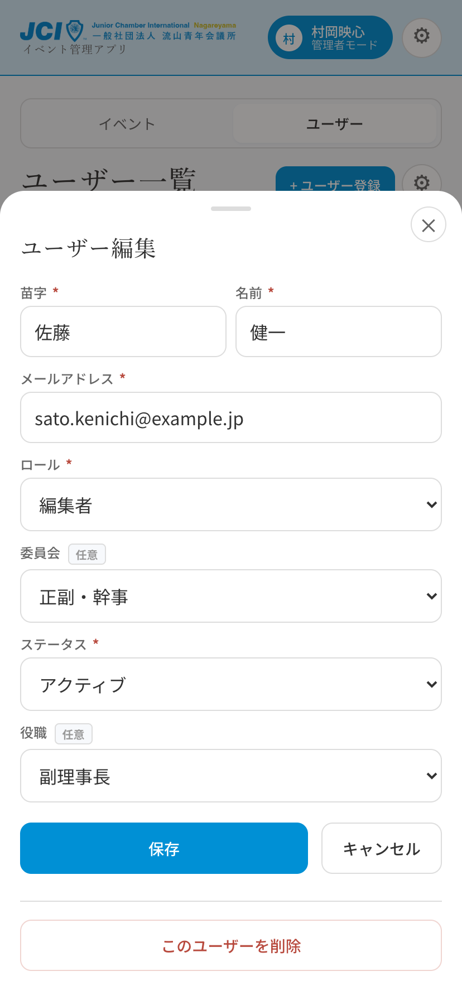

#### 一括変更
1. 各行のチェックボックスでユーザーを複数選択
2. 上部に青いバーが出る:「**{n}件選択中**」
3. 「**ステータス変更 / 委員会変更 / 役職変更**」 のいずれかをタップ
4. モーダルで新しい値を選んで「**適用する**」

#### 削除
ユーザー個別編集モーダルの下部に「**このユーザーを削除**」ボタン。

### 6-4. 設定

ユーザー管理画面の右上「**⚙**」をタップで設定モーダルが開きます。

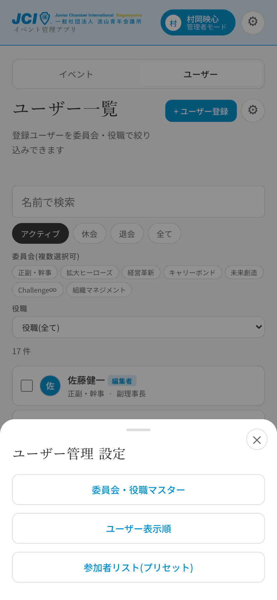

#### 委員会・役職マスター

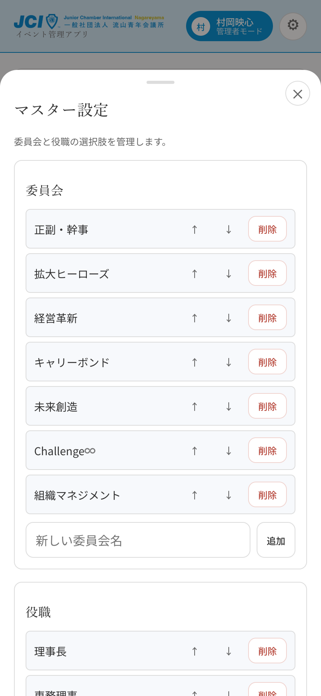
- 委員会名、役職名の選択肢を管理
- 追加 / 削除 / 並び替え (↑↓ ボタン)
- 並び順は新規ユーザー作成時のプルダウン順序になる

#### ユーザー表示順
- イベント作成時の「参加者選択」 リストで表示される順番を編集
- ↑↓ または ⤒ ⤓ (先頭/末尾移動) で並べ替え
- 「名前順にリセット」 で五十音順に戻す
- 退会者を含めるかどうかのチェックボックスあり

#### 参加者リスト (プリセット)
- 繰り返し使うメンバー集合を保存しておく機能
- 例: 「2026 年度 理事会メンバー」 「広報委員会 + 外部関係者」
- イベント作成時に「プリセットから読込」 で一括選択できる
- リスト名 + メンバー選択で作成

---

## 7. よくある質問

### Q. ログインできない
A. メールアドレスとパスワードを確認。仮パスワードでログインできない場合は管理者に再発行を依頼してください。

### Q. 出欠ボタンが押せない (グレーアウト)
A. 回答期限を過ぎています。期限の変更や代理回答は管理者に連絡してください。

### Q. QR コードが表示されない
A. 出欠を「出席」にして「保存する」が必要です。未回答や欠席だと QR は出ません。

### Q. 受付スキャナでカメラが起動しない
A. ブラウザがカメラ権限を持っているか確認してください。iOS Safari なら 設定 → Safari → カメラを「許可」。

### Q. 同じ人を 2 回スキャンしてしまった
A. 2 回目は「既に受付済」エラーになるだけで、データは壊れません。何もしなくて OK です。

### Q. 受付済を間違って付けてしまった
A. 受付モードの参加者リストでその人の「**✓受付済**」 バッジをタップして取消できます (確認ダイアログ付き)。

### Q. 委員会を変えたい
A. ユーザー本人からは変更できません。管理者に依頼してください。

### Q. 「システム管理者」というユーザーが見当たらない
A. 運用専用アカウントなので、参加者一覧やユーザー管理画面には表示されません。これは仕様です。

### Q. PC のブラウザでもログインできる?
A. はい、PC からも同じ URL でログインできます。基本動作は同じ。ただし PC は QR コード表示用カメラがない場合があるので、受付は基本スマホで。

### Q. 複数の端末でログインしたまま使える?
A. はい。同じアカウントでスマホと PC 両方ログインしっぱなしでも問題ありません。

### Q. ログイン状態はどれくらい保持される?
A. 約 1 週間 (7 日)。それ以降は再ログインが必要。

---

## 8. 困った時は

操作不能・データがおかしい・バグらしき動作 等あれば:

- システム管理者(村岡): `eishin-muraoka@dimage.co.jp`
- 不明点は遠慮なく上記までメールしてください

緊急時(イベント開催中の障害等)は電話 or LINE で直接連絡してください。
